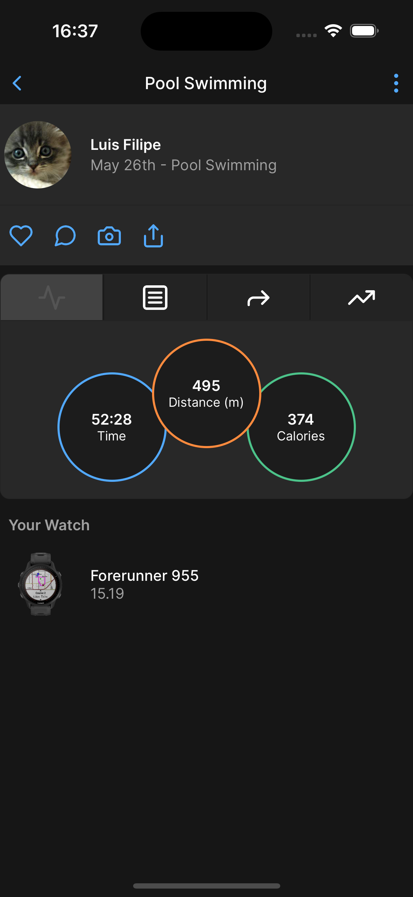

### 🌄 The Project

Garmin Connect is an application that connects your mobile phone with Garmin SmartWatch. 
The idea of this project is clone the Activity Detail page from Garmin Connect app in order to test [Tamagui](https://tamagui.dev/)

### 🛠 Tech Stack

- Expo ✅
- React Native ✅
- Tamagui ✅

### Preview

### Doubts?

Just reach me on [Slack](https://fueled.slack.com/team/U04248LC6G6) :)
